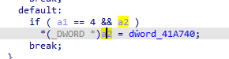
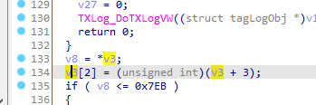
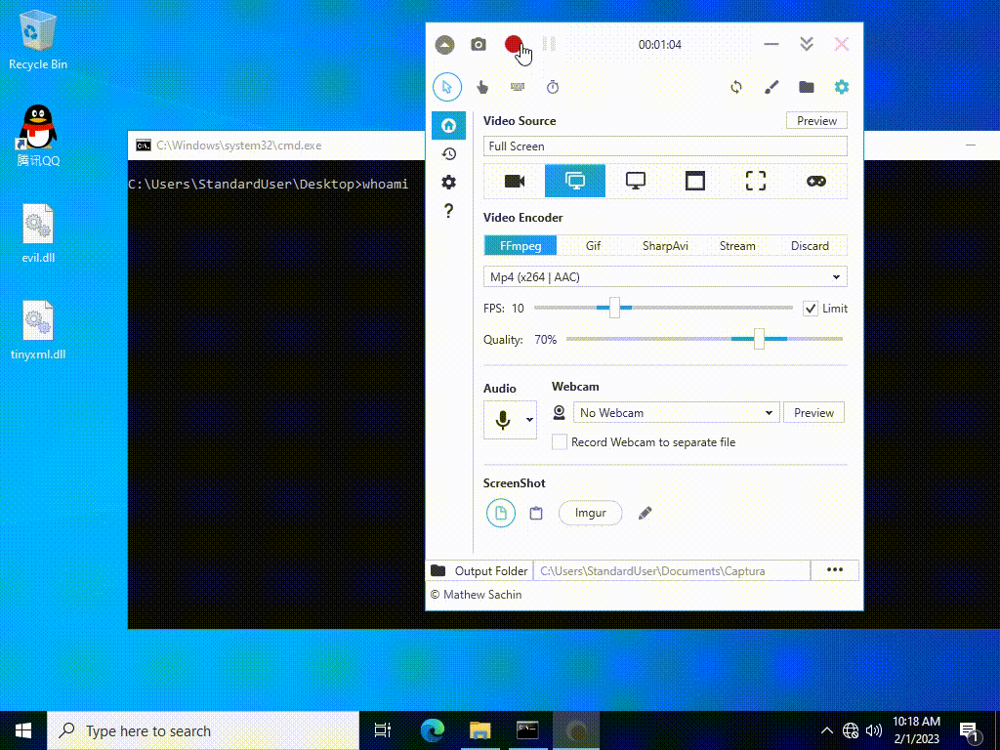

# Tencent QQ/TIM Local Privilege Elevation

Affected Products:
* QQ 9.7.1.28940 ~ 9.7.8.29039
* TIM 3.4.5.22071 ~ 3.4.7.22084

Affected Components:
* QQProtect.exe 4.5.0.9424 (in TIM 3.4.5.22071)
* QQProtect.exe 4.5.0.9426 (in QQ 9.7.1.28940)
* QQProtectEngine.dll 4.5.0.9424 (in TIM 3.4.5.22071)
* QQProtectEngine.dll 4.5.0.9426 (in QQ 9.7.1.28940)

## 1. Summary

Tencent [QQ](https://im.qq.com) and [TIM](https://tim.qq.com/) are two instant messaging softwares developped by Shenzhen Tencent Computer System Co., Ltd. They both have a component _QQProtect.exe_ locating in `%ProgramFiles(x86)%\Common Files\Tencent\QQProtect\bin`. _QQProtect.exe_ is installed as a Windows service named _QPCore_ and runs as `NT Authority\SYSTEM` automatically when system starts up. Both the component _QQProtect.exe_ and its dependent DLL _QQProtectEngine.dll_ have an arbitrary address write vulnerability. An attacker with low privilege can load evil DLL inside QQProtect.exe process by combining the two vulnerability and gets `NT Authority\SYSTEM` shell.

## 2. Vulnerability

The first vulnerability is the code at QQProtect.exe+0x40c9f8:



where `a2` is a pointer that can be controlled by an attacker and `dword_41a740` is a global variable whose value is `0x00000001`. So an attacker can write the value `DWORD(1)` at any address.

The second vulnerability is the code at QQProtectEngine.dll+0x3B4F6:



where `v3` is a pointer that can be controlled by an attacker. So an attacker can write the value `std::bit_cast<DWORD>(ptr) + 4` at any given address `ptr`.

An attacker can tamper with a function pointer resides in `QQProtect.exe` and use ROP chains to execute arbitray code easily due to the fact that `QQProtect.exe` does not have ASLR protection.

## 3. Proof of concepts

The poc code is written in Rust language. You should use `i686-pc-windows-msvc` toolchain to compile it.

```shell
$ cd poc
$ cargo +stable-i686-pc-windows-msvc build --release --config "build.rustflags = [\"-C\", \"target-feature=+crt-static\"]"
```

You will get two DLLs:

```
target\release\tinyxml.dll
target\release\evil.dll
```

Then put the two Dlls above and `%ProgramFiles(x86)%\Common Files\Tencent\QQProtect\bin\QQProtect.exe` togather in a folder.

Finally get `NT Authority\SYSTEM` shell with one command:

```shell
$ QQProtect.exe <PATH TO evil.dll>
```

## 4. Demonstration


